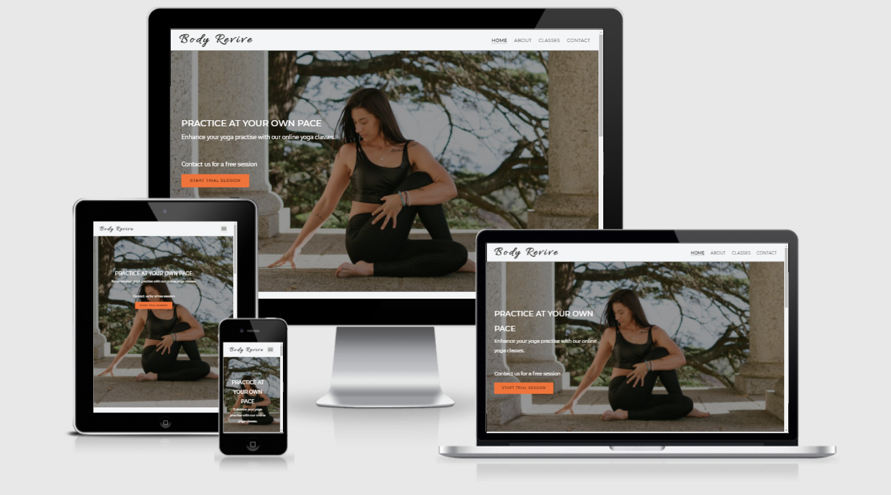

<h1 align="center">Body Revive Yoga Website</h1>

[View the live project here.](https://valerieoni.github.io/body-revive/)

body-revive website is a yoga studio website that offers online Hatha yoga classes to accommodate users’ schedule, allowing them to practice anywhere and whenever they want.

<h2 align="center"></h2>

The site is targeted at people with busy schedule as well as beginners curious about Yoga providing information to users interested in knowing more about yoga and online classes for them to sign-up.

## User Experience (UX)

-   ### User Goals

    -   #### First Time Visitor Goals
    
        - As a First Time Visitor, I want to easily get information on what the organization has to offer.
        - As a First Time Visitor, I want to look for testimonials to understand what their users think of them and see if they are trusted.
        - As a First Time Visitor, I want to sign up for a trial session.
    
    -   #### Returning Visitor's Goals

        - As a Returning Visitor, I want to easily find information about upcoming classes as well as the price.
        - As a Returning Visitor, I want to sign up for classes.
        - As a Returning Visitor, I want to find the best way to get in contact with the instructors with any questions I may have.
   
    -   #### Frequent Users Goals
        - As a Frequent Visitor, I want to sign up for classes and take part in the class signed up for.
        - As a Frequent Visitor, I want to successfully get in contact with the admin or instructors with any questions or challenges I may have.

-   ### Design
    -   #### Colour Scheme
        -   The three main colours used are orange, blue and off white.

    -   #### Typography
        -  Montserrat and Open Sans are the primary fonts used throughout the website, with Sans Serif serving as a fallback font in the event that a font cannot be properly imported into the site for any reason.
        - Allura is a simple, clean, and legible typeface that was created with advertising and display in mind, among other things. As a result, it is an ideal choice for the logo text.
        
    -   #### Imagery
        -  The large background hero image is meant to grab the user's attention and direct them to the home page. This is also used on the about page to introduce users to the studio's owner.

*   ### Wireframes

    -   Wireframes for this project - [View](docs/wireframes/br_wireframe.pdf)


## Features

- Instructor's profile
- classes offered, price and Course discount information (if available)
- Contact form
- Social media links
- Testimonials
- Resources - multimedia and information on Yoga

    ### Features Not Implemented

    As a result of time constraint the following features were not implemented:
    - Resources page which is meant to provide additional information to users
    - more testimonial added on the homepage and the ability to scroll through the available testimonials.
    
    In the future these can be reviewed and included in the site.

## Technologies Used

### Languages Used

-   [HTML5](https://en.wikipedia.org/wiki/HTML5)
-   [CSS3](https://en.wikipedia.org/wiki/Cascading_Style_Sheets)

### Frameworks, Libraries & Programs Used

- [GitHub:](https://github.com/)
    - GitHub is used to store the projects code after being pushed from Git.
- [Git](https://git-scm.com/)
    - Git was used for version control by utilizing the Gitpod terminal to commit to Git and Push to GitHub.
- [Balsamiq:](https://balsamiq.com/)
    - Balsamiq was used to create the [wireframes](https://github.com/) during the design process.
- [Google Fonts:](https://fonts.google.com/)
    - Google fonts were used to import the 'Titillium Web' font into the style.css file which is used on all pages throughout the project.
- [Font Awesome:](https://fontawesome.com/)
    - Font Awesome was used to add icons.
- [Birme:](https://www.birme.net/)
    - Birme was used to resize and edit images for the website
- [Pexel:](https://www.pexels.com/)
    - Pexel was used to sourcing images used for the website
- [Pixabay:](https://pixabay.com/)
    - Pixabay was also used to sourcing images used for the website
- [UNPKG:](https://unpkg.com/)
    - UNPKG used for unpacking svg files used on the home page.
- [AM I RESPONSIVE](http://ami.responsivedesign.is/)
    - used to show off the responsive design across the different devices.


## Testing

The W3C Markup Validator and W3C CSS Validator Services were used to validate every page of the project to ensure there were no syntax errors in the project.

-   [W3C Markup Validator](https://validator.w3.org/) - [Results](docs/W3C_Validator_results.pdf)
-   [W3C CSS Validator](https://jigsaw.w3.org/css-validator/#validate_by_input) - [Results](docs/W3C_CSS_Validator_results.pdf)


### Testing User Stories from User Experience (UX) Section

-   #### First Time Visitor Goals

    1. As a First Time Visitor, I want to easily get information on what the organization has to offer.

        - When a user first visits the site, they are greeted with a navigation bar that allows them to quickly find what they are looking for. Along with the hero image is a call to action button which encourages users to start a trial session.
        - The site also has the about page which provides more information and an image of the studio owner.

    2. As a First Time Visitor, I want to look for testimonials to understand what their users think of them and see if they are trusted.

        - The home page features a simple, clearly labelled testimonial section which contains feedback from users. This is clearly visible to the user as they scrolls down the page.

    3. As a First Time Visitor, I want to sign up for a trial session.
        - Once the user visits the site one of the features which stands out is the "Trial Session" call to action button on the homepage.


-   #### Returning Visitor Goals

    1. As a Returning Visitor, I want to easily find information about upcoming classes as well as the price.

        - These are clearly shown in the banner message.
        - They will be directed to a page with another hero image and call to action.

    2. As a Returning Visitor, I want to sign up for classes.
        - The navigation bar clearly highlights the "classes" page
        - The classes, schedule and prices as well as the call to action "sign up" button is clearly visible on the page.

    3. As a Returning Visitor, I want to find the best way to get in contact with the organisation with any questions I may have.

        - The navigation bar clearly highlights the "Contact Us" Page.
        - Here they can fill out the form on the page and are given a feedback that they will be contacted.
        - The footer contains links to the organisations Facebook, Twitter and Instagram page which all open on a new tab to ensure the user can easily get back to the website.
   

## Deployment

### GitHub Pages

The site was deployed to GitHub pages. The steps to deploy are as follows:

-   In the GitHub repository, navigate to the Settings tab
-   Scroll down the Settings page until you locate the "GitHub Pages" Section.
-   Under "Source", click the dropdown called "None" and select "Master Branch".
-   Once the master branch has been selected, the page will be automatically refreshed.
-   Upon refreshing the page the user is informed that the site has been successfully published with a link to the published site.


### Making a Local Clone

1. Locate the [body-revive Repository](https://github.com/valerieoni/body-revive)
2. click the `Code ` dropdown arrow
3. To clone the repository using HTTPS, copy the [link](https://github.com/valerieoni/body-revive.git) 
4. Open Git Bash
5. Change the current working directory to the location where you want the cloned directory to be made.
6. Type `git clone`, and then paste the URL you copied in Step 3.

```
$ git clone https://github.com/valerieoni/body-revive.git
```

7. Press Enter. Your local clone will be created.

```
$ git clone https://github.com/valerieoni/body-revive.git
> Cloning into `CI-Clone`...
> remote: Counting objects: 10, done.
> remote: Compressing objects: 100% (8/8), done.
> remove: Total 10 (delta 1), reused 10 (delta 1)
> Unpacking objects: 100% (10/10), done.
```

## Credits

### Code

-   The full-screen hero image code came from this [pexel](https://www.pexels.com/)

-   [MDN Web Docs](https://developer.mozilla.org/) : For Pattern Validation code. Code was modified to better fit my needs and to match an Irish phone number layout to ensure correct validation. Tutorial Found [Here](https://developer.mozilla.org/en-US/docs/Web/HTML/Element/input/tel#Pattern_validation)

### Content

-   All content was written by the developer.


### Media

-   All Images were sourced from [pexel](https://www.pexels.com/) and [pixabay](https://pixabay.com/). Some of the images used are:
    -   Home Page - [Photo by RF._.studio from Pexels](https://www.pexels.com/photo/woman-in-black-tank-top-and-black-leggings-sitting-on-floor-3820296/)
    -   About Us Image - [Photo by Thirdman from Pexels](https://www.pexels.com/photo/woman-in-black-sports-bra-and-leggins-posing-on-yoga-mat-6958387/)
    -   Class Page - [Photo by Yan Krukov from Pexels](https://www.pexels.com/photo/people-in-fitness-clothes-doing-yoga-8436574/)
    -   Contact Us Image -[Photo by cottonbro from Pexels](https://www.pexels.com/photo/person-in-blue-long-sleeve-shirt-holding-black-smartphone-5053766/)

### Acknowledgements

-   I would like to express my gratitude to my mentor, Narender Singh, for his guidance and feedback throughout this project.

-   I would like to thank the Code Institute's Slack community for their assistance.

-   I would also like to thank Tutor support at Code Institute for their support.
